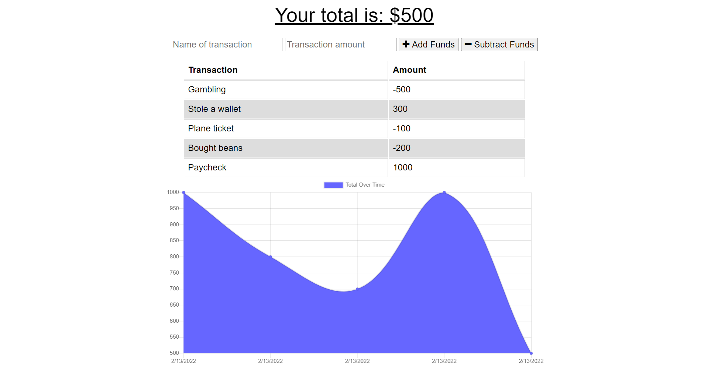

  # Budget Tracker
  

  ## Table of Contents:
  * [Description](#description)
  * [Installation](#installation)
  * [Usage](#usage)
  
 * [License](#license)
  * [Contributors](#contributors)
  * [Questions](#questions)
  
  ## Description:
  The budget tracker app is a simple app that can be used to keep track of one's budget, primarily intended for use with travel. The app template was given beforehand and I added offline capabilities utilizing IndexedDB and service workers. When internet connection drops, the app is still functional and saves changes when connection is reestablished.
  
 https://budget-tracker-project-123.herokuapp.com/

  ## Installation:
  You can simply visit the above link to use the site - it is deployed on heroku.

  ## Usage:
  Simply enter a name for the transaction, a dollar amount, and then click add or subtract based on the transaction. Note that offline transactions will be saved when internet connection is restored. 
    
S  
 ## License:
  Licensed under the MIT license.

  ## Contributors
  Feel free to open issues with any requests, concerns, etc.

  ## Questions
  You can reach me for additional questions at:
  * GitHub: [jtboyman](https://github.com/jtboyman)
  * Email: jtboyman@gmail.com
